* [快速入门](#快速入门)
   * [ES快速入门](#ES-快速入门)
      * [ES部署](#ES部署)
      * [ES录入](#ES录入)
   * [Hadoop快速入门](#Hadoop-快速入门)
      * [Hadoop部署](#Hadoop部署)
      * [Hadoop录入](#Hadoop录入)
   * [Kafka 快速入门](#Kafka-快速入门)
      * [Kafka部署](#Kafka部署)
* [功能介绍](#功能介绍)
   * [ES模块功能介绍](#ES模块功能介绍)
      * [ES集群信息](#ES集群信息)
      * [ES集群录入](#ES集群录入)
      * [ES集群创建](#ES集群创建)
      * [ES集群扩容](#ES集群扩容)
      * [ES集群缩容](#ES集群缩容)
      * [ES执行记录](#ES执行记录)
   * [Hadoop模块功能介绍](#Hadoop模块功能介绍)
      * [Hadoop集群信息](#Hadoop集群信息)
      * [Hadoop集群录入](#Hadoop集群录入)
      * [Hadoop集群创建](#Hadoop集群创建)
      * [Hadoop集群扩容](#Hadoop集群扩容)
      * [Hadoop集群缩容](#Hadoop集群缩容)
      * [Hadoop执行记录](#Hadoop执行记录)
   * [Kafka模块功能](#Kafka模块功能)
      * [Kafka集群信息](#Kafka集群信息)
      * [Kafka集群创建](#Kafka集群创建)
      * [Kafka集群扩容](#Kafka集群扩容)
      * [Kafka执行记录](#Kafka执行记录)
      
# 快速入门

## ES 快速入门

### ES部署

**集群部署**：是根据用户填写的信息，部署一套es分布式集群。综合考虑，目前平台es部署集群的最小规模是5个节点：（3个master角色，2个data角色）

**前置条件** ：需要至少准备5台独立机器(已部署gse agent，并且没启动es进程)，部署时每个节点间不能混合进程部署

部署集群参数说明（带\*必填）：

| **参数名称** | **参数说明** | **备注** |
| --- | --- | --- |
| 业务名称\* | 创建集群时绑定业务名称 | 可选业务名称列表是根据用户的配置平台的权限同步 |
| 集群名称\* | 创建集群时指定的集群名称 | 平台唯一 |
| 版本选择\* | 平台目前提供的版本选择 | 暂不增加 |
| Master node\* | 填写对应的集群master 角色的IP信息列表 | 暂不支持混合部署，不能重复。多个用隔开符隔开，支持的隔开符：空格、空行、英文逗号|
| Data node\* | 填写对应的集群data角色的IP信息列表 | 暂不支持混合部署，不能重复。多个用隔开符隔开，支持的隔开符：空格、空行、英文逗号 |
| Cold node | 填写对应的集群cold data 角色的IP信息列表 | 暂不支持混合部署，不能重复。多个用隔开符隔开，支持的隔开符：空格、空行、英文逗号 |
| Client node | 填写对应的集群client data 角色的IP信息列表 | 暂不支持混合部署，不能重复。多个用隔开符隔开，支持的隔开符：空格、空行、英文逗号 |
| 用户名\* | 创建集群时指定的初始化用户信息 |
| 密码\* | 创建集群时指定的初始化用户密码信息 |
| 项目描述 | 填写集群的场景描述 |

跳转ES执行记录页面可看到部署集群的运行状态

部署成功之后跳转到ES集群信息，可以看ES部署信息。

选择对应集群信息操作属性的&quot;集群详情&quot;，则可查看集群的详细信息

### ES录入

**集群录入** ：如果用户已存在一套的ES集群，可以通过录入的方式将集群给平台进行托管。（注意：目前版本由于考虑到兼容性问题，录入的集群暂时屏蔽ES的管理功能，如扩缩容等。V2.0版本将开放，敬请期待）

**前置条件** ：保证待录入es集群是健康集群，并部署job平台的gse agent

录入集群参数说明（带\*必填）

| **参数名称** | **参数说明** | **备注** |
| --- | --- | --- |
| 业务名称\* | 选择待录入集群时对应的业务名称 | 可选业务名称列表是根据用户的配置平台的权限同步 |
| 集群名称\* | 选择待录入集群时指定的集群名称 | 平台唯一 |
| 集群版本\* | 选择待录入集群时es版本代号 | 手动录入，格式为x.x.x |
| 用户名 | 若待录入集群时存在root用户信息，填写指定用户信息 |
| 密码 | 若待录入集群时存在root用户信息，填写指定用户密码信息 |
| 项目描述 | 填写集群的场景描述 |

选择ES录入集群信息，填写对应信息。

跳转ES执行记录页面可看到部署录入的运行状态

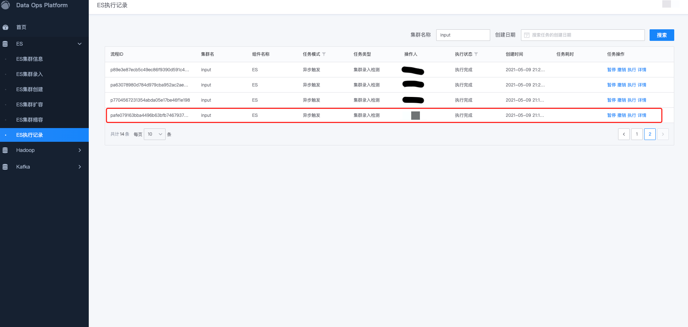

部署成功之后跳转到ES集群信息，可以看ES录入信息。

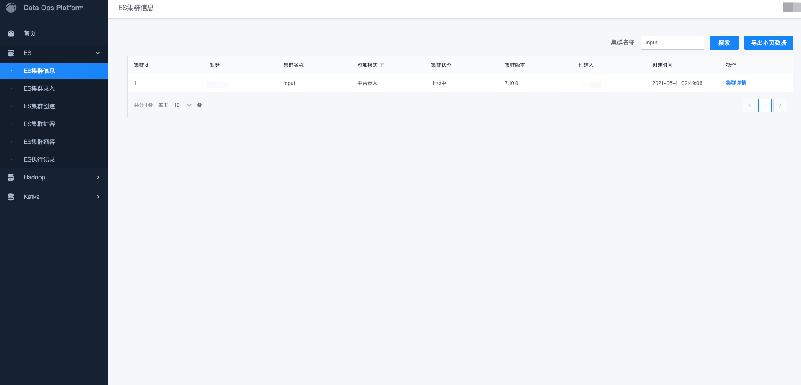

选择对应集群信息操作属性的&quot;集群详情&quot;，则可查看集群的详细信息

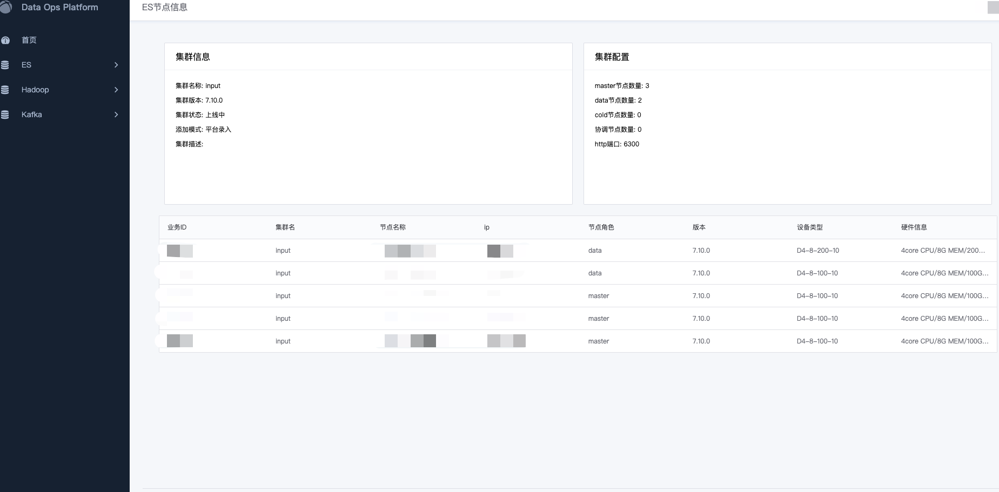

## Hadoop 快速入门

### Hadoop部署
**集群部署**：根据用户对Hadoop生态的需求，填写对应的部署信息，部署一套Hadoop集群（目前V1.0版本只支持hdfs和 yarn组件部署，hdfs部署信息是必填的，未来版本增加更多的Hadoop生态组件，敬请期待）

**前置条件**：需要至少准备3台独立机器(已部署gse agent，没有部署过hdfs和 yarn进程)，机器可混合部署进程

部署集群参数说明（带\*必填）：

| **参数名称** | **参数说明** | **备注** |
| --- | --- | --- |
| 业务名称\* | 创建集群时绑定业务名称 | 可选业务名称列表是根据配置平台同步 |
| 集群名称\* | 创建集群时指定的集群名称 | 平台唯一 |
| 版本选择\* | 平台目前提供的版本选择 | 暂不增加 |
| hdfs数据目录\* | 填写hdfs的数据目录列表 | 可填写多个，若不存在则部署自动创建 |
| Hdfs副本数量\* | 填写对应的hdfs的副本数量 | 数量范围 1-3 |
| ssh远程端口\* | 填写机器的远程端口号 | 需要做用户免认证，必须每台机器的远程端口是一致 |
| NameNode\* | 填写集群namenode IP信息 | 机器可混合进程部署，必须在平台新输入，不能与StandbyNameNode一致。 多个用隔开符隔开，支持的隔开符：空格、空行、英文逗号 |
| StandbyNameNode\* | 填写集群StandbyNameNode IP信息 | 机器可混合进程部署，必须在平台新输入，不能与namenode一致。多个用隔开符隔开，支持的隔开符：空格、空行、英文逗号|
| DataNode\* | 填写集群DataNode IP信息 | 机器可混合进程部署，必须在平台新输入，机器数量不能少于副本数量。多个用隔开符隔开，支持的隔开符：空格、空行、英文逗号 |
| JournalNode\* | 填写集群JournalNode IP信息 | 机器可混合进程部署，必须在平台新输入，机器数量必须等于3台。多个用隔开符隔开，支持的隔开符：空格、空行、英文逗号 |
| ZookeeperNode\* | 填写集群ZookeeperNode IP信息 | 机器可混合进程部署，必须在平台新输入，机器数量必须等于3台。多个用隔开符隔开，支持的隔开符：空格、空行、英文逗号 |
| ResourceManagerNode | 填写集群ResourceManagerNode IP信息 | 机器可混合进程部署，必须在平台新输入，机器数量必须等于2台。多个用隔开符隔开，支持的隔开符：空格、空行、英文逗号|
| NodeManagerNode | 填写集群NodeManagerNode IP信息 | 机器可混合进程部署，必须在平台新输入，前提ResourceManagerNode有部署信息。 多个用隔开符隔开，支持的隔开符：空格、空行、英文逗号|
| 集群描述 | 填写集群的场景描述 |

进入hadoop集群部署页面，根据提示填写对应的部署信息，部署对应集群

进入hadoop执行记录后，可查看刚才的部署信息

部署任务执行完成之后，进入Hadoop集群信息，可查看部署后的集群信息状态（每个用户的查询信息是根据配置平台的权限而显示对应集群信息）

点击操作栏的&quot;集群详情&quot;可看到集群的详细情况

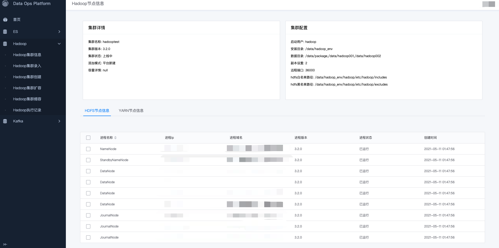

### Hadoop录入

**集群录入**：如果用户已存在对应的Hadoop集群，可以通过录入的方式将集群给平台进行托管。（注意：目前版本由于考虑到兼容性问题，录入的集群暂时屏蔽Hadoop的管理功能，如扩缩容等。V2.0版本将开放，敬请期待）

**前置条件** ：保证填写的集群信息是正确的，保证待录入hadoop集群是健康集群。

部署集群参数说明（带\*必填）：

| **参数名称** | **参数说明** | **备注** |
| --- | --- | --- |
| 业务名称\* | 选择待录入集群时绑定业务名称 | 可选业务名称列表是根据用户的配置平台的权限同步 |
| 集群名称\* | 选择待录入集群时指定的集群名称 | 平台唯一 |
| 版本选择\* | 选择待录入集群时平台目前提供的版本选择信息 | 暂不能增加，目前只支持2.6.0/3.2.0/other(代表其他版本号) |
| 集群启动账号 | 填写待录入集群时启动进程账号 |
| 集群安装目录 | 填写待录入集群时集群安装目录 |
| ssh远程端口\* | 填写待录入集群机器的远程端口号 |
| 域名映射关系 | 填写待录入集群机器的IP和域名的对应关系 | 输入格式： ip/dnsname， 多个用隔开符隔开，支持的隔开符：空格、空行、英文逗号 |
| Hdfs白名单路径 | 填写待录入集群机器的hdfs 的白名单配置信息 | 需要正确的绝对路径 |
| Hdfs黑名单路径 | 填写待录入集群机器的hdfs 的黑名单配置信息 | 需要正确的绝对路径 |
| hdfs数据目录\* | 填写待录入集群的hdfs的数据目录列表 | 可填写多个，用逗号或者空格隔开 |
| Hdfs副本数量\* | 填写待录入集群的hdfs的副本数量 |
| NameNode\* | 填写待录入集群namenode IP信息 | 
| StandbyNameNode\* | 填写待录入集群StandbyNameNode IP信息 |
| DataNode\* | 填写待录入集群DataNode IP信息 | 多个用隔开符隔开，支持的隔开符：空格、空行、英文逗号 |
| JournalNode\* | 填写待录入集群JournalNode IP信息 |多个用隔开符隔开，支持的隔开符：空格、空行、英文逗号 |
| ZookeeperNode\* | 填写待录入集群ZookeeperNode IP信息 | 多个用隔开符隔开，支持的隔开符：空格、空行、英文逗号 |
| ResourceManagerNode | 填写待录入集群ResourceManagerNode IP信息 | 多个用隔开符隔开，支持的隔开符：空格、空行、英文逗号。 若没部署则无效填写 |
| NodeManagerNode | 填写待录入集群NodeManagerNode IP信息 | 多个用隔开符隔开，支持的隔开符：空格、空行、英文逗号。若没部署则无效填写 |
| 集群描述 | 填写待录入集群的场景描述 |

进入hadoop集群录入页面，根据提示填写对应的录入信息，录入对应集群(录入集群目前分为4个表单填写对应集群信息)

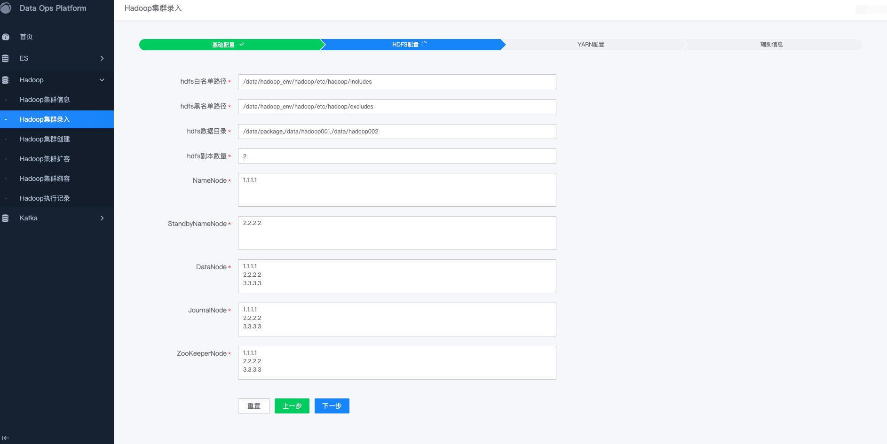

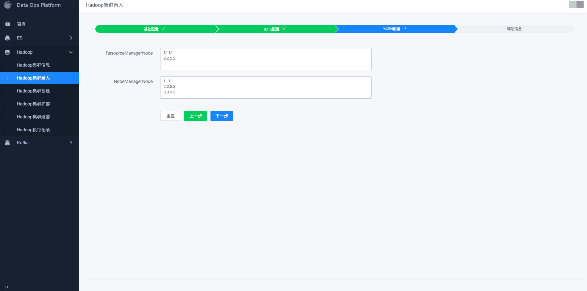

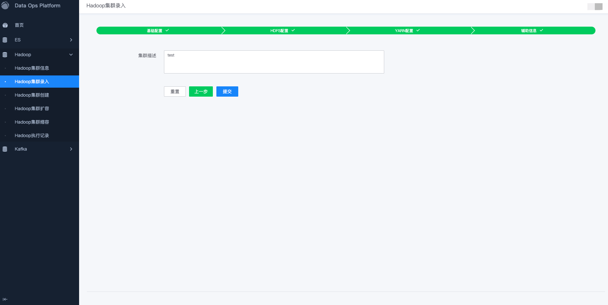

填写无误后则点击&quot;提交&quot;

进入hadoop执行记录后，可查看刚才的部署信息

录入任务执行完成之后，进入Hadoop集群信息，可查看录入后的集群信息状态（每个用户的查询信息是根据配置平台的权限而显示对应集群信息）

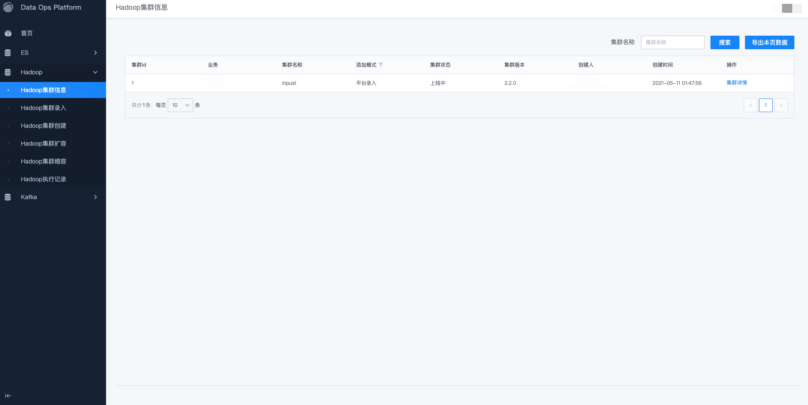

点击操作栏的&quot;集群详情&quot;可看到集群的详细情况

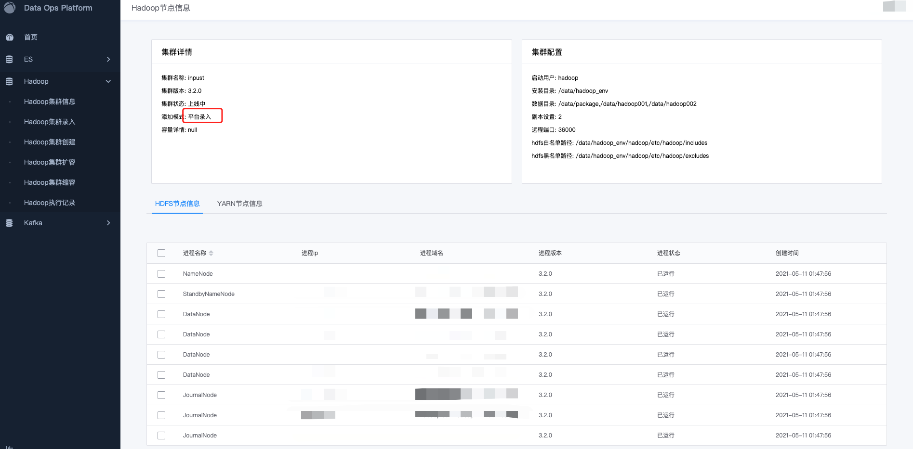

## Kafka 快速入门

### Kafka部署

**集群部署**：是根据用户填写的信息，部署一套kafka高可用集群。综合考虑，目前平台kafka部署集群的最小规模是3个节点，不能混部署

**前置条件** ：至少需要3台独立机器（已部署好 gse agent，没有启动kafka和zookeeper的进程）

部署集群参数说明（带\*必填）：

| **参数名称** | **参数说明** | **备注** |
| --- | --- | --- |
| 业务名称\* | 创建集群时绑定业务名称 | 可选业务名称列表是根据用户的配置平台的权限同步 |
| 集群名称\* | 创建集群时指定的集群名称 | 平台唯一 |
| 版本选择\* | 平台目前提供的版本选择 | 暂不增加 |
| Broker | 填写集群每个broker的IP信息 | 多个用隔开符隔开，支持的隔开符：空格、空行、英文逗号 |
| 项目描述 | 填写集群的场景描述 |

进入kafka执行记录后，可查看刚才的部署信息

部署完成之后，进入集群信息查询，既可查询到当前集群信息

点击集群详情，可看到对应的broker和topic信息

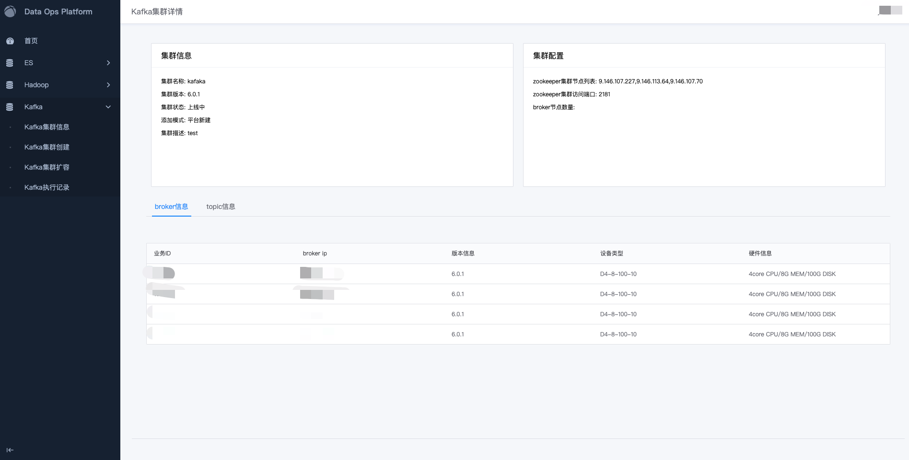

# 功能介绍

## ES模块功能介绍

### ES集群信息

功能概述：提供ES集群查询功能，用户在查询时是基于根据在配置平台拥有的业务权限来返回对应集群信息（若用户没有任何业务的权限，则显示为空）

管理功能列表：搜索功能、导出数据功能、集群详情（查询集群内部的详细进程部署信息等）

参数说明：无

### ES集群录入

功能概述：提供录入ES集群信息功能，适配后由平台来管控非平台创建的ES集群(注意：目前版本由于考虑到兼容性问题，录入的集群暂时屏蔽的管控功能，如扩缩容等。V2.0版本将开放，敬请期待）

管理功能列表：无

参数说明：\&lt;查看快速入门ES部署说明\&gt;

### ES集群创建

功能概述：平台提供一键式部署ES高可用功能

管理功能列表：无

参数说明：\&lt;查看快速入门ES部署说明\&gt;

### ES集群扩容

功能概述：提供针对ES集群的节点扩容功能， 可支持主节点，数据节点，冷数据节点和协调节点的扩容

管理功能列表：无

参数说明：（带\*号是必填项）

| **参数名称** | **参数说明** | **备注** |
| --- | --- | --- |
| 集群名称\* | 选择待操作集群时指定的集群名称 |
| 数据角色\* | 选择ES节点需要扩容的节点角色 |
| 扩容IP\* | 则需要填写对应的新增IP列表信息 | 多个用隔开符隔开，支持的隔开符：空格、空行、英文逗号 |

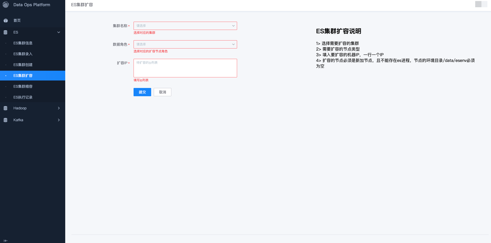

### ES集群缩容

功能概述：提供针对ES集群的节点回收功能(注意：回收后主节点和数据节点不能等于，否则集群存在问题)

管理功能列表：无

参数说明：（带\*号是必填项）

| **参数名称** | **参数说明** | **备注** |
| --- | --- | --- |
| 集群名称\* | 选择待操作集群时指定的集群名称 |
| 缩容IP\* | 则需要填写对应的新增IP列表信息 | 多个用隔开符隔开，支持的隔开符：空格、空行、英文逗号。IP必须在对应的集群内部部署 |

### ES执行记录

功能概述：平台记录目前所有操作集群变更的记录，以便任务追踪和回溯

管理功能列表：
搜索（可根据集群名称和任务创建时间过滤）；
暂停（可安全暂停任务）；
撤销（对任务进程撤销，撤销后任务无法再次唤醒）；
执行（对正在暂停的任务重新唤醒执行）；
详情（查询任务的流程状态）

参数说明：无

## Hadoop模块功能介绍

### Hadoop集群信息

功能概述：提供Hadoop集群查询功能，用户在查询时是基于根据在配置平台拥有的业务权限来返回对应集群信息（若用户没有任何业务的权限，则显示为空）

管理功能列表：搜索功能、导出数据功能、集群详情（查询集群内部的详细进程部署信息等）

参数说明：无

### Hadoop集群录入

功能概述：提供录入Hadoop集群信息功能，适配后由平台来管控非平台创建的Hadoop集群(注意：目前版本由于考虑到兼容性问题，录入的集群暂时屏蔽的管控功能，如扩缩容等。V2.0版本将开放，敬请期待）

管理功能列表：无

参数说明：\&lt;查看快速入门Hadoop部署说明\&gt;

### Hadoop集群创建

功能概述：平台提供一键式部署Hadoop高可用功能，目前支持hdfs和yarn搭建，部署时yarn集群可选

管理功能列表：无

参数说明：\&lt;查看快速入门Hadoop部署说明\&gt;

### Hadoop集群扩容

功能概述：平台对已存在的Hadoop集群提供在线扩容功能，目前扩容功能只是针对hdfs集群，并提供两种扩容方式（DataNode节点扩容、目录(磁盘)扩容）

管理功能列表：无

参数说明：

| **参数名称** | **参数说明** | **备注** |
| --- | --- | --- |
| 集群名称\* | 选择待操作集群时指定的集群名称 |
| 扩容模式\* | 选择集群扩容模式 |
| 扩容IP列表 | 若选择datanode节点扩容，则需要填写对应的新增IP列表信息 | 多个用隔开符隔开，支持的隔开符：空格、空行、英文逗号|
| 扩容目录路径 | 若选择datanode目录扩容，则需要填写对应的新增的目录名称 | 多个用隔开符隔开，支持的隔开符：空格、空行、英文逗号 |

### Hadoop集群缩容

功能概述：平台对已存在的Hadoop集群提供在线节点回收功能，目前缩容功能只是针对hdfs集群的DataNode节点回收

管理功能列表：无

参数说明：

| **参数名称** | **参数说明** | **备注** |
| --- | --- | --- |
| 集群名称\* | 选择待操作集群时指定的集群名称 |
| 缩容IP列表\* | 选择集群内待回收datanode进程的IP |

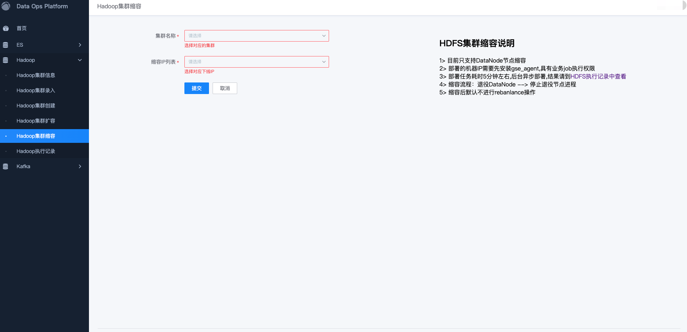

### Hadoop执行记录

功能概述：平台记录目前所有操作集群变更的记录，以便任务追踪和回溯

管理功能列表：
搜索（可根据集群名称和任务创建时间过滤）；
暂停（可安全暂停任务）；
撤销（对任务进程撤销，撤销后任务无法再次唤醒）；
执行（对正在暂停的任务重新唤醒执行）；
详情（查询任务的流程状态）

参数说明：无

## Kafka模块功能

### Kafka集群信息

功能概述：提供kafka集群查询功能。用户在查询时是基于根据在配置平台拥有的业务权限来返回对应集群信息（若用户没有任何业务的权限，则显示为空）

管理功能列表：集群详情：查询集群内部的详细进程部署信息等

参数说明：无

### Kafka集群创建

功能概述：平台提供一键式部署kafka集群高可用的功能

管理功能列表：无

参数说明：\&lt;查看快速入门kafka部署说明\&gt;

### Kafka集群扩容

功能概述：提供kafka集群针对broker的在线节点扩容能力

管理功能列表：无

参数说明：

| **参数名称** | **参数说明** | **备注** |
| --- | --- | --- |
| 集群名称\* | 选择待操作集群时指定的集群名称 |
| 扩容IP列表\* | 填写待扩容集群的指定新的IP信息 | 多个用隔开符隔开，支持的隔开符：空格、空行、英文逗号 |

### Kafka执行记录

功能概述：平台记录目前所有操作集群变更的记录，以便任务追踪和回溯

管理功能列表：
搜索（可根据集群名称和任务创建时间过滤）；
暂停（可安全暂停任务）；
撤销（对任务进程撤销，撤销后任务无法再次唤醒）；
执行（对正在暂停的任务重新唤醒执行）；
详情（查询任务的流程状态）

参数说明：无

